# Sobre

## Seção: `Arquitetura de Software MSC`

- lore

#
<div align="center">
  <a href="https://raw.githubusercontent.com/davidrogger/trybe-project-talker-manager/readme-update/readme-imgs/project_top.webp">
    
  </a>
  <a href="https://raw.githubusercontent.com/davidrogger/trybe-project-talker-manager/readme-update/readme-imgs/project_mid.webp">
    
  </a>
  <a href="https://raw.githubusercontent.com/davidrogger/trybe-project-talker-manager/readme-update/readme-imgs/project_bot.webp">
    
  </a>
</div>

>*Imagens da documentação do swagger*
#
## Projeto: `Store Manager`

- CRUD de uma API utilizando arquitetura **MSC** (Model Service Controller), de uma loja de super heroes.

# Tecnologias e ferramentas usadas 🛠


# Desafios

- Boa parte do projeto foi desenolvida usando o metodo **TDD** (Test Driven Development), uma outra parte para entender melhor o que era retornado e entender o que deveria ser aplicado no teste unitário fiz sem TDD aplicando o teste na sequência.

- Organizar toda aplicação, cada arquivo responsável por uma determinada parte. **Route** centralizando todas as rotas de um determinado caminho para lidar somente com aquela roda em especifico. **Controller** lidando com requisições e chamando **Serviços** responsaveis por lidar com validações e chamadas de busca no banco por meio dos **models**.

- Entender a documentação da biblioteca do **Joi**, para ter mais eficiência e agilidade nas validações do corpo necessário para o melhor funcionamento das requisições.

# Conclusão

- Maior desafio foi de como definir os testes iniciais, como escrever de forma clara (usando o inglês para treino do idioma), organizar as funcionalidades em camadas da API usando o conceito de **MSC**, encontrar funcionalidades que facilitariam as validações usando o **joi**, e também entender o que os requisitos dos testes solicitados pela trybe do projeto esperavam no desenvolvimento.
Quero melhorar algumas partes do projeto na parte de teste, e a parte de documentação do swagger, essa foi a minha primeira vez usando ele, para coletar algumas imagens e aprensentar alguns endpoints.

</details>

<details>
  <summary>
    <strong>
      :newspaper_roll: Requisitos solicitados durante o desenvolvimento do projeto
    </strong>
  </summary>

 
  ### Requisitos
  *Nome* | *Avaliação*
  --- | :---:
01 - Crie endpoints para listar produtos | :heavy_check_mark:
02 - Desenvolva testes que cubram no mínimo 5% das camadas da sua aplicação | :heavy_check_mark:
03 - Crie endpoint para cadastrar produtos | :heavy_check_mark:
04 - Crie validações para produtos | :heavy_check_mark:
05 - Desenvolva testes que cubram no mínimo 10% das camadas da sua aplicação | :heavy_check_mark:
06 - Crie endpoint para validar e cadastrar vendas | :heavy_check_mark:
07 - Desenvolva testes que cubram no mínimo 15% das camadas da sua aplicação | :heavy_check_mark:
08 - Crie endpoints para listar vendas | :heavy_check_mark:
09 - Desenvolva testes que cubram no mínimo 20% das camadas da sua aplicação | :heavy_check_mark:
10 - Crie endpoint para atualizar um produto | :heavy_check_mark:
11 - Desenvolva testes que cubram no mínimo 25% das camadas da sua aplicação | :heavy_check_mark:
12 - Crie endpoint para deletar um produto | :heavy_check_mark:
13 - Desenvolva testes que cubram no mínimo 30% das camadas da sua aplicação | :heavy_check_mark:
14 - Crie endpoint para deletar uma venda | :heavy_check_mark:
15 - Desenvolva testes que cubram no mínimo 35% das camadas da sua aplicação | :heavy_check_mark:
16 - Crie endpoint para atualizar uma venda | :heavy_check_mark:
17 - Desenvolva testes que cubram no mínimo 40% das camadas da sua aplicação | :heavy_check_mark:
18 - Crie endpoint products/search?q=searchTerm | :heavy_check_mark:
19 - Desenvolva testes que cubram no mínimo 50% das camadas da sua aplicação | :heavy_check_mark:
20 - Desenvolva testes que cubram no mínimo 60% das camadas da sua aplicação | :heavy_check_mark:


</details>

<details>
  <summary>
    <strong>
      :memo: Todo list
    </strong>
  </summary>

  - [x] - ~~Criar aplicação com base nos requisitos da trybe.~~ 

</details>

<details>
  <summary>
    <strong>
      :computer: Instruções do  Projeto
    </strong>
  </summary>

> ### Importante seguir a ordem apresentada a baixo, para o funcionamento.

<details>
<summary>
  <strong>
    ⚠️ Configurações mínimas para execução do projeto
  </strong>
</summary>

  > - Sistema Operacional Distribuição Unix
  > - Node versão >= 16
  > - Docker
  > - Docker-compose versão >=1.29.2
  > - API Client ([Thunder Client](https://www.thunderclient.com/), [Insomnia](https://insomnia.rest/), [POSTMAN](https://www.postman.com/), ou algum outro de sua preferência)

  </details>

  <details>
  <summary>
    <strong>
      ⚠️ Inicie o docker-compose
    </strong>
  </summary>

  >Após clonar o respositório para iniciar o docker compose, você deve dentro da pasta raiz do projeto usar o comando: `docker-compose up -d`
  >Verifique os containers usando o comando `docker ps` no terminal. Deve aparecer dois containers com o nome de *store_manager e *store_manager_db*.
  </details>

  <details>
  <summary>
    <strong>
      ⚙️ Variáveis de ambiente
    </strong>
  </summary>

  >Deve-se remover a extensão `sample` do arquivo .env na raiz do projeto com o seguinte conteúdo:
  >```
  >MYSQL_HOST=127.0.0.1
  >MYSQL_USER=root
  >MYSQL_PASSWORD=password
  >MYSQL_DATABASE=StoreManager
  >PORT=3000
  >```
  </details>

  <details>
    <summary>
      <strong>
        🗂 Acessando as Rotas
      </strong>
    </summary>

  >Existem duas formas de acessar e testar as rotas:
  >1. Usando algum API Cliente, conforme citado nas configurações mínimas.
  >2. Acessando a documentação gerada pelo swagger `localhost:3000/api-docs`.
  >3. Usando teste automatizado no terminal,  `docker exec -it store_manager npm run test:mocha`

  <details>  
  <summary>
    <span>Endpoint <code>/products</code></span>
  </summary>

  ## GET - `localhost:3000/products/search`

  > - Rota responsável por realizar uma consultas por qualquer palavra inclusa em um nome de produto.
  > - Para buscar um produto, é necessário realizar uma requisição usando o parametro `q` seguindo do nome que deseja filtrar.
  > ### Exemplo:
  >```
  >localhost:3000/products/search?q=Martelo
  >```
  > ### Status:
  > - **`200`**: Retorna com um json com uma lista com o filtro da palavra usada, caso não encontre nada, retorna uma lista vazia.

  ## GET - `localhost:3000/products/:id`

  > - Rota responsável por realizar uma consulta do produto por seu *id*.
  > - Para buscar um produto, é necessário realizar uma requisição usando o parametro com o ID.
  > ### Exemplo:
  >```
  >localhost:3000/products/1
  >```
  > ### Status:
  > - **`200`**: Retorna um json com detalhes do produto referente há aquele ID.
  > - **`404`**: Retorna um json com a mensagem `Product not found`.
  > - **`422`**: Retorna um json com a mensagem `"id" must be a number`.

  </details>

  <details>
  <summary>
      <span>Endpoint <code>/talker</code></span>
  </summary>

  ## GET - `localhost:3000/talker`

  >- Rota responsável por apresentar todos palestrantes cadastrados.
  > - **`200`**: Em caso de sucesso, retorna com um json todos palestrantes cadastrados.

  ## POST - `localhost:3000/talker`

  > - Rota responsável por cadastrar palestrantes.
  > - É necessário adicionar ao headers o token para executar esta requisição.
  > - Para cadastrar um palestrante, é necessário realizar uma requisição com um corpo json contendo os seguindos dados.
  > - **`name`**: Nome deve conter no mínimo 3 caracteres.
  > - **`age`**: Idade deve ser um número maior que 18, pois os palestrantes devem ser maiores de 18 anos.
  > - **`talk`**: Deve ser um objecto contento seguintes chaves:
  >     - **`watchedAt`**: Deve conter a data da apresentação seguindo uma formatação `dd/mm/aaaa`
  >     - **`rate`**: Deve ser uma nota entre 1 e 5.
  > ### Exemplo:
  >```
  >{
  >  "name": "Jonas Doe",
  >  "age": "30",
  >  "talk": {
  >   "watchedAt": "10/02/2023",
  >   "rate": "4"
  >  }
  >}
  >```
  > ### Status:
  > - **`201`**: Em caso de sucesso, com um json com os dados cadastrados contendo o id do palestrante.
  > - **`400`**: Caso algum campo não esteja preenchido ou esteja fora do padrão.
  > - **`401`**: Quando o acesso não é autorizado, faltando definir um token para acesso.

  ## GET - `localhost:3000/talker/search`

  > - Rota responsável por buscar palestrante por nome.
  > - É necessário adicionar ao headers o token para executar esta requisição.
  > - Para buscar um palestrante, é necessário realizar uma requisição usando o parametro q seguindo do nome que deseja localizar.
  > ### Exemplo:
  >```
  >localhost:3000/talker/search?q=Henrique
  >```
  > ### Status:
  > - **`200`**: Em caso de sucesso, retorna um json todos palestrantes que contém o nome usado no parametro. Caso seja passado um parametro vazio `?q=`, é retornado todos palestrantes cadastrados.
  > - **`401`**: Quando o acesso não é autorizado, faltando definir um token para acesso.

  ## GET - `localhost:3000/talker/:id`

  > - Rota responsável por buscar palestrante pelo ID.
  > - Para buscar um ID, é necessário realizar uma requisição usando o parametro apontando o ID que deseja localizar.
  > ### Exemplo:
  >```
  >localhost:3000/talker/1
  >```
  > ### Status:
  > - **`200`**: Em caso de sucesso, retorna com um json com os dados do ID indicado no parametro.
  > - **`404`**: Quando o ID não é encontrato.

  ## PUT - `localhost:3000/talker/:id`

  > - Rota responsável por atualizar dados do palestrante pelo ID.
  > - É necessário adicionar ao headers o token para executar esta requisição.
  > - Para atualizar, é necessário realizar uma requisição usando o parametro apontando o ID que deseja localizar com um corpo json com todos dados do palestrante seguindo o mesmo modelo json usado para cadastrar um novo palestrante.
  > ### Status:
  > - **`200`**: Em caso de sucesso, retorna com um json com os dados cadastrados atualizados do palestrante.
  > - **`400`**: Caso algum campo não esteja preenchido ou esteja fora do padrão.
  > - **`401`**: Quando o acesso não é autorizado, faltando definir um token para acesso.
    > - **`404`**: Quando o ID não é encontrato.

  ## DELETE - `localhost:3000/talker/:id`

  > - Rota responsável por deletar cadastro do palestrante pelo ID.
  > - É necessário adicionar ao headers o token para executar esta requisição.
  > - Para deletar, é necessário realizar uma requisição usando o parametro apontando o ID que deseja deletar.
  > ### Exemplo:
  >```
  >localhost:3000/talker/1
  >```
  > ### Status:
  > - **`204`**: Em caso de sucesso, retorna somente o status 204(no content).
  > - **`401`**: Quando o acesso não é autorizado, faltando definir um token para acesso.
  > - **`404`**: Quando o ID não é encontrato.

  </details>

  </details>
</details>

#

<div align="right">
  
</div>


#


<details>
  <summary>
    <strong>
      🗂 Acessando as Rotas
    </strong>
  </summary>

As rodas desenvolvidas no projeto são;

# /products

<details>
  <summary>
    Exemplo:
  </summary>

  ⚠️ Pode ser usado o URL em seu navegador, um API Client ou acessando a rota `localhost:3000/docs` em seu navegador.

  <a href="./img/swagger_searchProductName.png">
    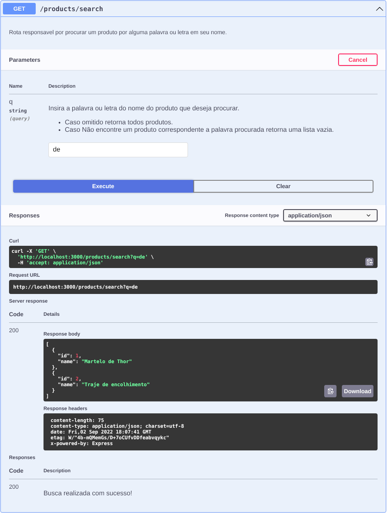</img>
  </a>

</details>

#
### GET - `localhost:3000/products/:id`
- 
<details>
  <summary>
    Exemplo:
  </summary>

  ⚠️ Pode ser usado o URL em seu navegador, um API Client ou acessando a rota `localhost:3000/docs` em seu navegador.

  <a href="./img/swagger_getProductId.png">
    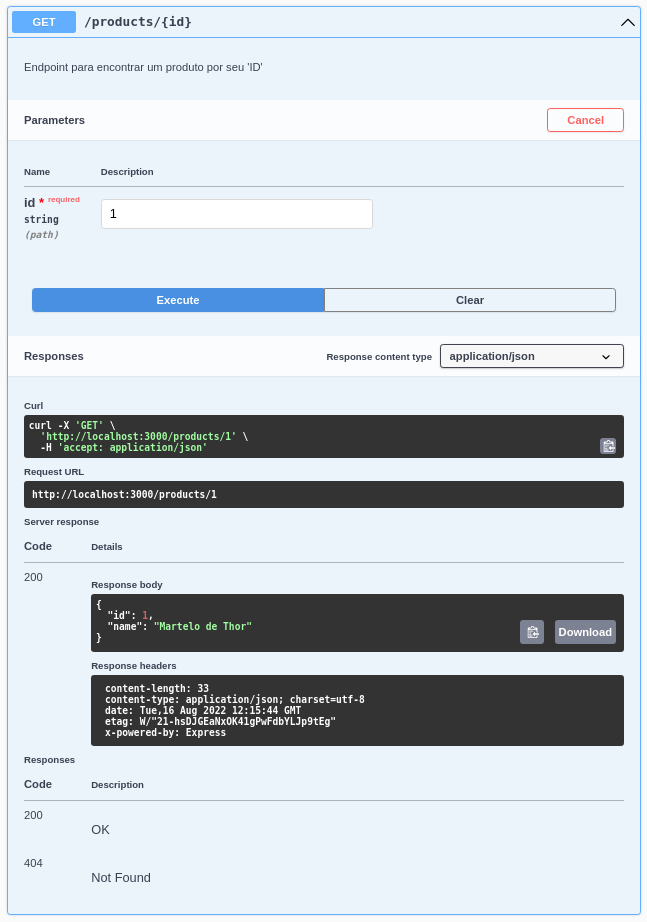</img>
  </a>

</details>

#
### PUT - `localhost:3000/products/:id`
- Rota responsável por realizar atualização de um produto especifico com base em seu *id*.
<details>
  <summary>
    Exemplo:
  </summary>

  ⚠️ Necessário uso de um API Client ou acessando a rota `localhost:3000/docs` em seu navegador.

<a href="./img/swagger_getProductUpdate.png">
  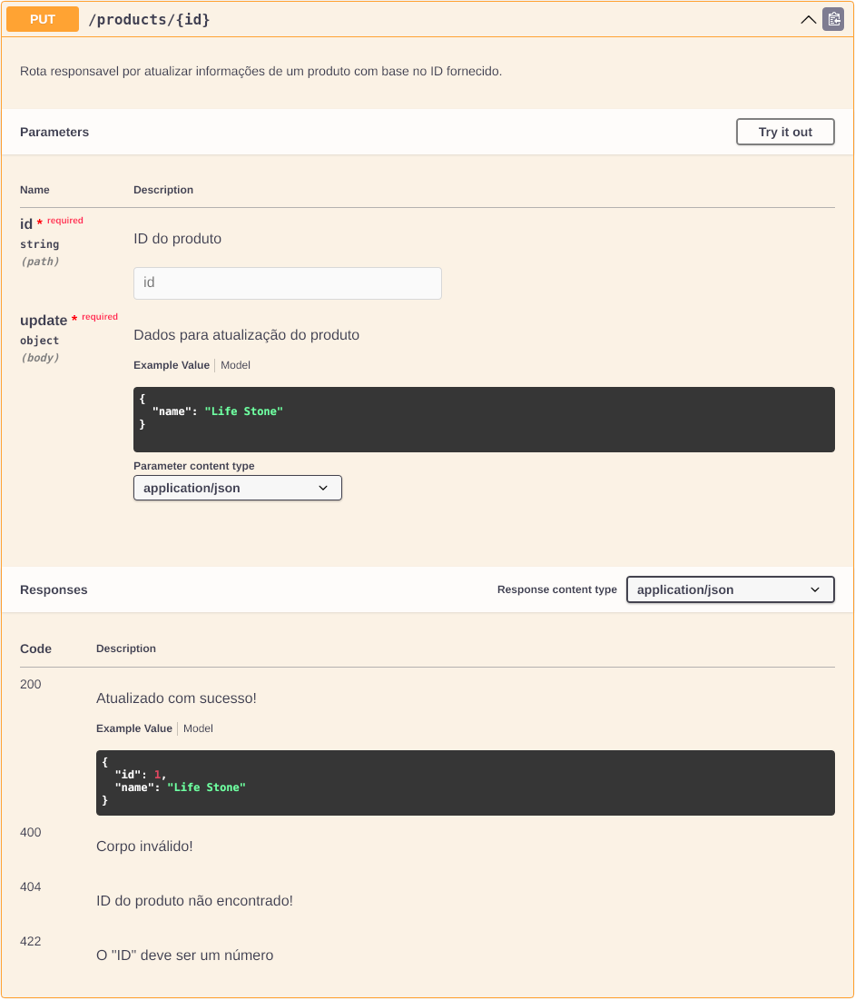</img>
</a>

</details>


#
### DELETE - `localhost:3000/products/:id`
- Rota responsável por deletar um produto especifico com base em seu *id*.
<details>
  <summary>
    Exemplo:
  </summary>

  ⚠️ Necessário uso de um API Client ou acessando a rota `localhost:3000/docs` em seu navegador.

  <a href="./img/swagger_getProductDelete.png">
    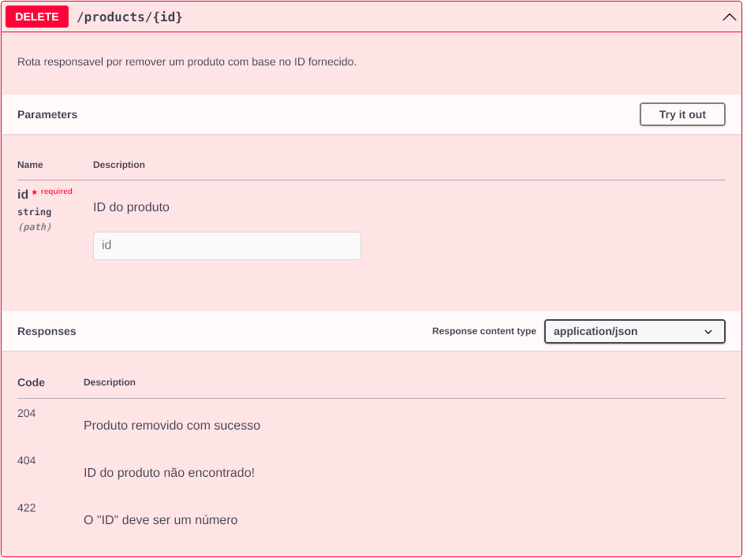</img>
  </a>

</details>

#
### GET - `localhost:3000/products`
- Rota responsável por apresentar todos os produtos cadastrados no banco de dados.
<details>
  <summary>
    Exemplo:
  </summary>

  ⚠️ Pode ser usado o URL em seu navegador, um API Client ou acessando a rota `localhost:3000/docs` em seu navegador.

  <a href="./img/swagger_getProductAll.png">
    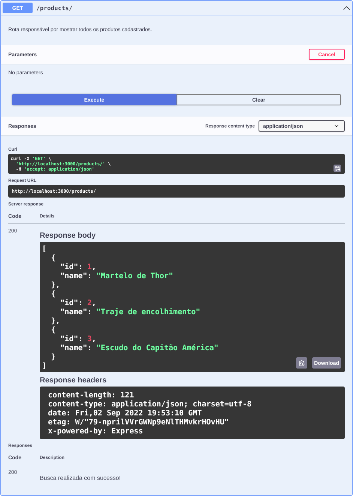</img>
  </a>

</details>

#
### POST - `localhost:3000/products`
- Rota responsável por cadastrar um novo produto ao banco de dados.
<details>
  <summary>
    Exemplo:
  </summary>

  ⚠️ Necessário uso de um API Client ou acessando a rota `localhost:3000/docs` em seu navegador.

  <a href="./img/swagger_getProductAdd.png">
    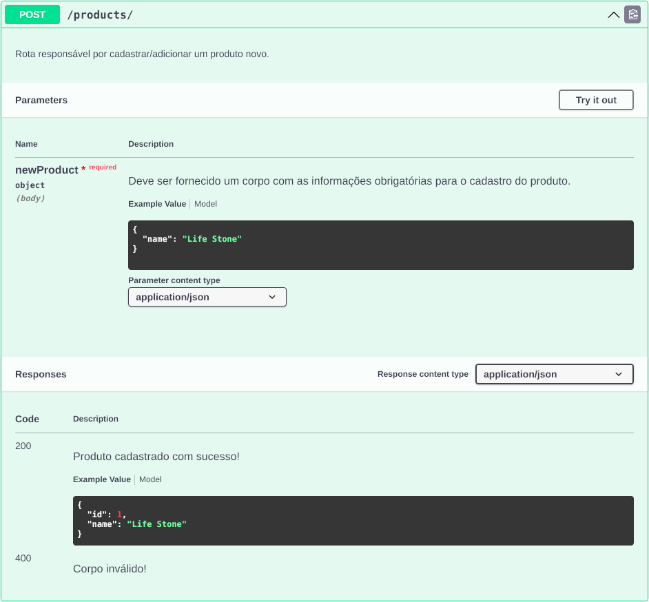</img>
  </a>

</details>

#
# /sales
### GET - `localhost:3000/sales/:id`
- Rota responsável por realizar uma consulta por uma venda especifica com base em seu *id*.
<details>
  <summary>
    Exemplo:
  </summary>

  ⚠️ Pode ser usado o URL em seu navegador, um API Client ou acessando a rota `localhost:3000/docs` em seu navegador.

  <a href="./img/swagger_getSaleId.png">
    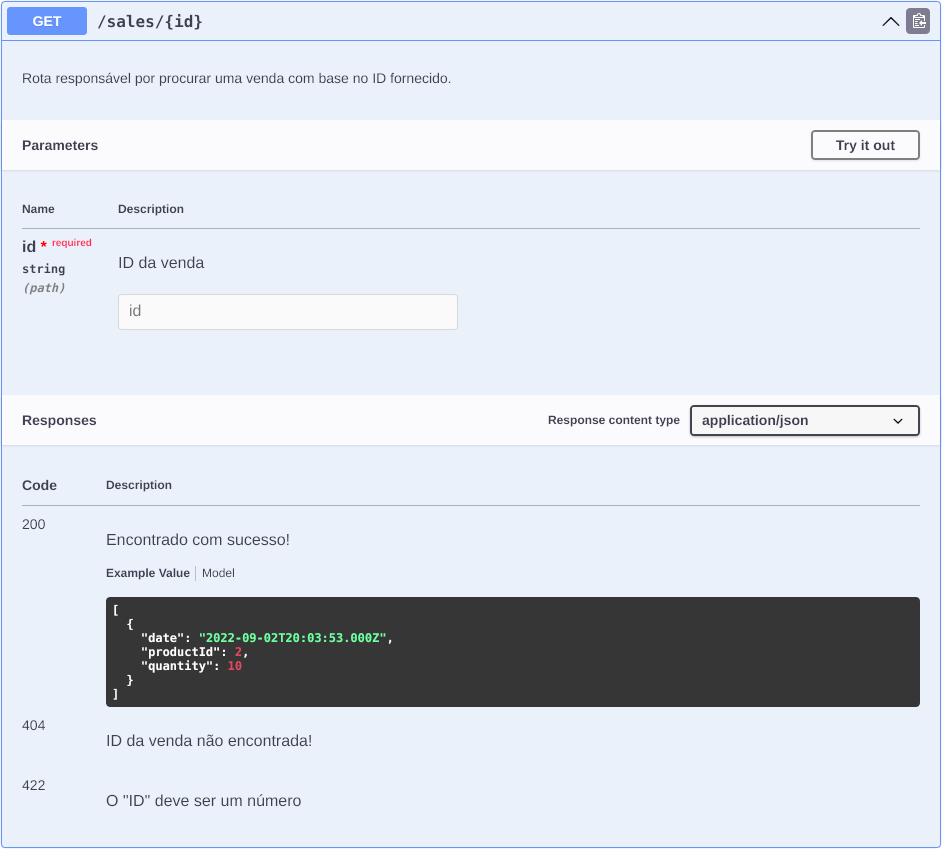</img>
  </a>

</details>

#
### PUT - `localhost:3000/sales/:id`
- Rota responsável por realizar atualização de uma venda especifica com base em seu *id*.
<details>
  <summary>
    Exemplo:
  </summary>

  ⚠️ Necessário uso de um API Client ou acessando a rota `localhost:3000/docs` em seu navegador.

  <a href="./img/swagger_getSaleUpdate.png">
    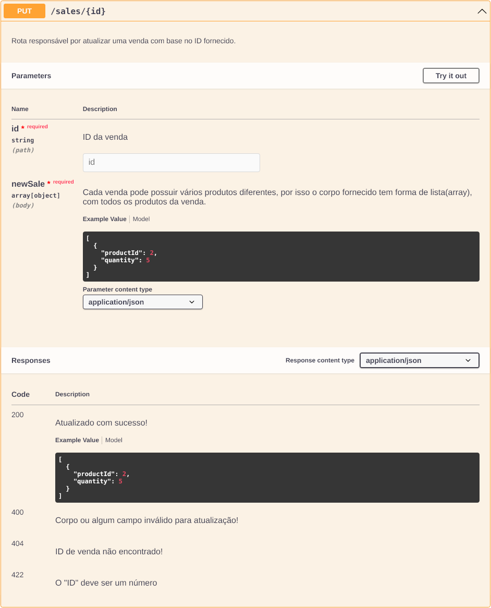</img>
  </a>

</details>

#
### DELETE - `localhost:3000/sales/:id`
- Rota responsável por deletar uma venda especifica com base em seu *id*.
<details>
  <summary>
    Exemplo:
  </summary>

  ⚠️ Necessário uso de um API Client ou acessando a rota `localhost:3000/docs` em seu navegador.

  <a href="./img/swagger_getSaleDelete.png">
    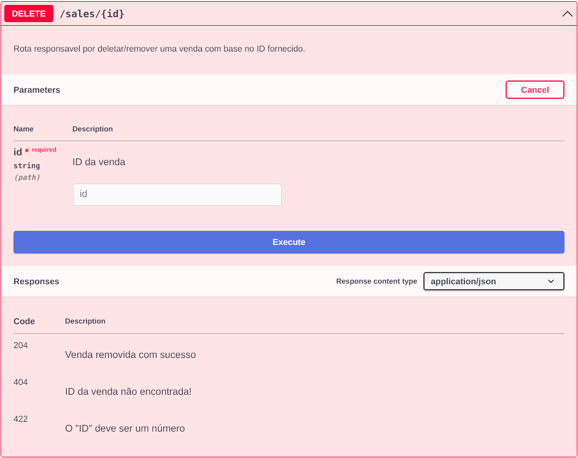</img>
  </a>

</details>

#
### GET - `localhost:3000/sales`
- Rota responsável por apresentar todas as vendas cadastrados no banco de dados.
<details>
  <summary>
    Exemplo:
  </summary>

  ⚠️ Pode ser usado o URL em seu navegador, um API Client ou acessando a rota `localhost:3000/docs` em seu navegador.

  <a href="./img/swagger_getSaleAll.png">
    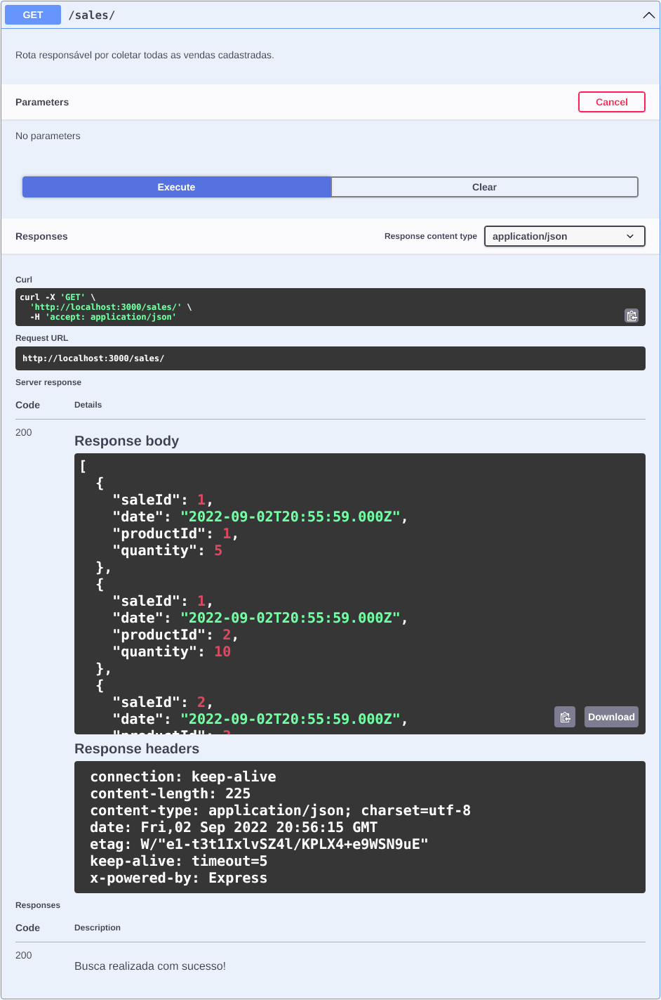</img>
  </a>

</details>

#
### POST - `localhost:3000/sales`
- Rota responsável por cadastrar uma nova venda ao banco de dados.
<details>
  <summary>
    Exemplo:
  </summary>

  ⚠️ Necessário uso de um API Client ou acessando a rota `localhost:3000/docs` em seu navegador.

  <a href="./img/swagger_addSale.png">
    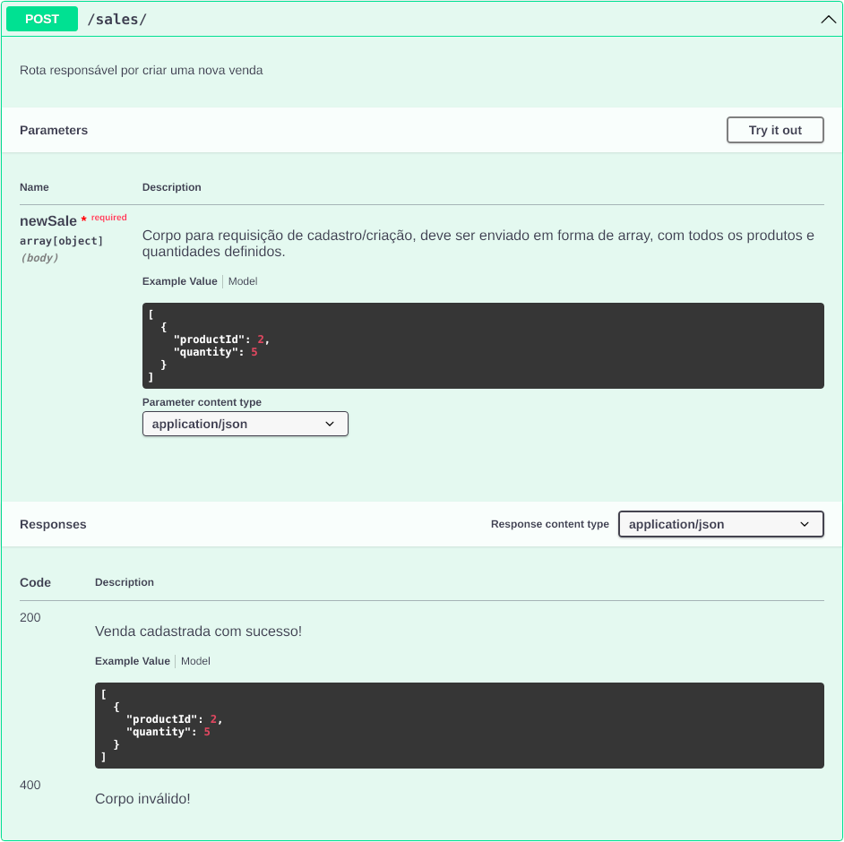</img>
  </a>

</details>

</details>
