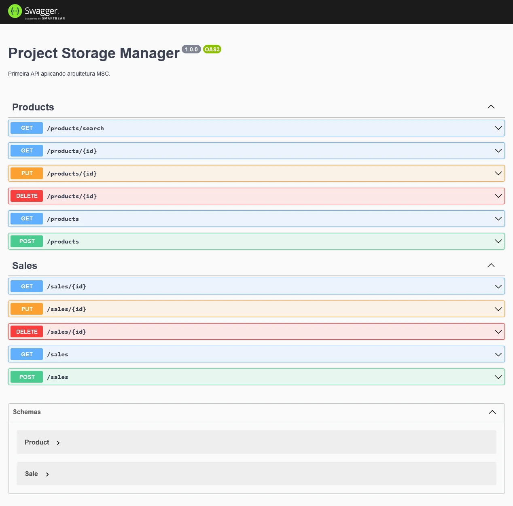
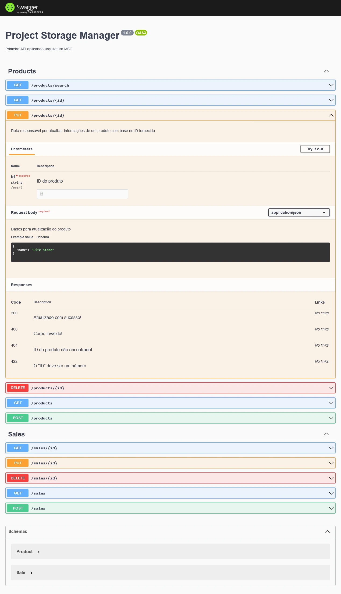
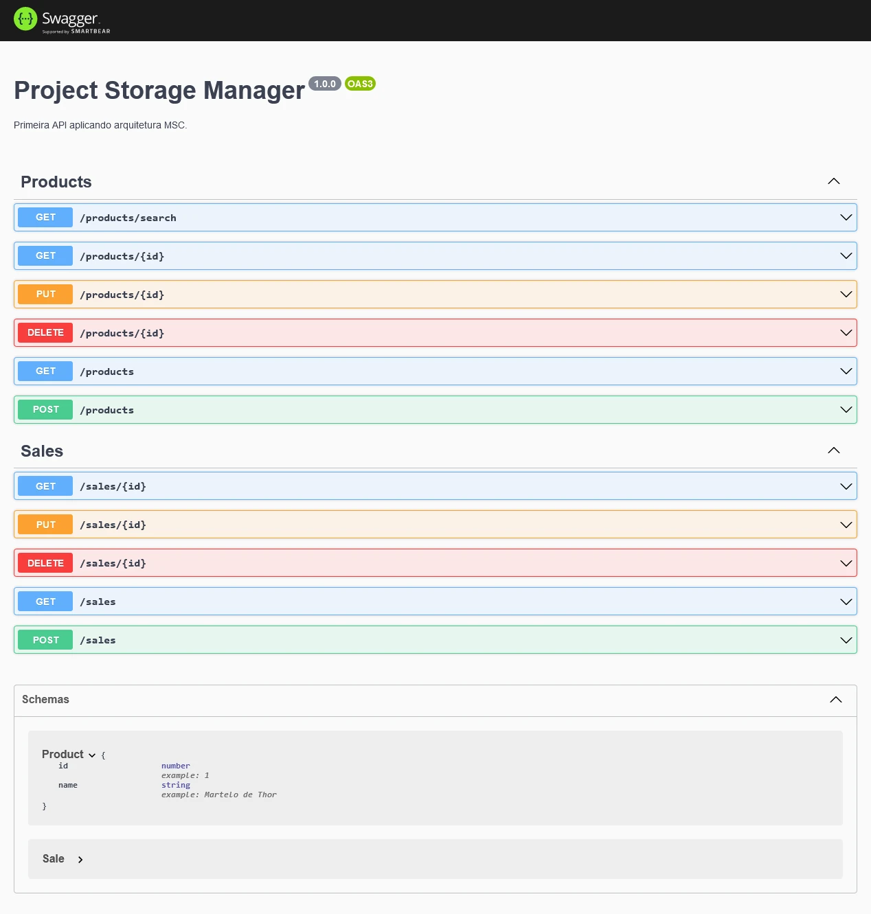

# Sobre

## Seção: `Arquitetura de Software MSC`

- lore

#
<div align="center">
  <a href="https://raw.githubusercontent.com/davidrogger/trybe-project-talker-manager/readme-update/readme-imgs/project_top.webp">
    
  </a>
  <a href="https://raw.githubusercontent.com/davidrogger/trybe-project-talker-manager/readme-update/readme-imgs/project_mid.webp">
    
  </a>
  <a href="https://raw.githubusercontent.com/davidrogger/trybe-project-talker-manager/readme-update/readme-imgs/project_bot.webp">
    
  </a>
</div>

>*Imagens da documentação do swagger*
#
## Projeto: `Store Manager`

- CRUD de uma API utilizando arquitetura **MSC** (Model Service Controller), de uma loja de super heroes.

# Tecnologias e ferramentas usadas 🛠


# Desafios

- Boa parte do projeto foi desenolvida usando o metodo **TDD** (Test Driven Development), uma outra parte para entender melhor o que era retornado e entender o que deveria ser aplicado no teste unitário fiz sem TDD aplicando o teste na sequência.

- Organizar toda aplicação, cada arquivo responsável por uma determinada parte. **Route** centralizando todas as rotas de um determinado caminho para lidar somente com aquela roda em especifico. **Controller** lidando com requisições e chamando **Serviços** responsaveis por lidar com validações e chamadas de busca no banco por meio dos **models**.

- Entender a documentação da biblioteca do **Joi**, para ter mais eficiência e agilidade nas validações do corpo necessário para o melhor funcionamento das requisições.

# Conclusão

- Maior desafio foi de como definir os testes iniciais, como escrever de forma clara (usando o inglês para treino do idioma), organizar as funcionalidades em camadas da API usando o conceito de **MSC**, encontrar funcionalidades que facilitariam as validações usando o **joi**, e também entender o que os requisitos dos testes solicitados pela trybe do projeto esperavam no desenvolvimento.
Quero melhorar algumas partes do projeto na parte de teste, e a parte de documentação do swagger, essa foi a minha primeira vez usando ele, para coletar algumas imagens e aprensentar alguns endpoints.

</details>

<details>
  <summary>
    <strong>
      :newspaper_roll: Requisitos solicitados durante o desenvolvimento do projeto
    </strong>
  </summary>

 
  ### Requisitos
  *Nome* | *Avaliação*
  --- | :---:
01 - Crie endpoints para listar produtos | :heavy_check_mark:
02 - Desenvolva testes que cubram no mínimo 5% das camadas da sua aplicação | :heavy_check_mark:
03 - Crie endpoint para cadastrar produtos | :heavy_check_mark:
04 - Crie validações para produtos | :heavy_check_mark:
05 - Desenvolva testes que cubram no mínimo 10% das camadas da sua aplicação | :heavy_check_mark:
06 - Crie endpoint para validar e cadastrar vendas | :heavy_check_mark:
07 - Desenvolva testes que cubram no mínimo 15% das camadas da sua aplicação | :heavy_check_mark:
08 - Crie endpoints para listar vendas | :heavy_check_mark:
09 - Desenvolva testes que cubram no mínimo 20% das camadas da sua aplicação | :heavy_check_mark:
10 - Crie endpoint para atualizar um produto | :heavy_check_mark:
11 - Desenvolva testes que cubram no mínimo 25% das camadas da sua aplicação | :heavy_check_mark:
12 - Crie endpoint para deletar um produto | :heavy_check_mark:
13 - Desenvolva testes que cubram no mínimo 30% das camadas da sua aplicação | :heavy_check_mark:
14 - Crie endpoint para deletar uma venda | :heavy_check_mark:
15 - Desenvolva testes que cubram no mínimo 35% das camadas da sua aplicação | :heavy_check_mark:
16 - Crie endpoint para atualizar uma venda | :heavy_check_mark:
17 - Desenvolva testes que cubram no mínimo 40% das camadas da sua aplicação | :heavy_check_mark:
18 - Crie endpoint products/search?q=searchTerm | :heavy_check_mark:
19 - Desenvolva testes que cubram no mínimo 50% das camadas da sua aplicação | :heavy_check_mark:
20 - Desenvolva testes que cubram no mínimo 60% das camadas da sua aplicação | :heavy_check_mark:


</details>

<details>
  <summary>
    <strong>
      :memo: Todo list
    </strong>
  </summary>

  - [x] - ~~Criar aplicação com base nos requisitos da trybe.~~ 

</details>

<details>
  <summary>
    <strong>
      :computer: Instruções do  Projeto
    </strong>
  </summary>

> ### Importante seguir a ordem apresentada a baixo, para o funcionamento.

<details>
<summary>
  <strong>
    ⚠️ Configurações mínimas para execução do projeto
  </strong>
</summary>

  > - Sistema Operacional Distribuição Unix
  > - Node versão >= 16
  > - Docker
  > - Docker-compose versão >=1.29.2
  > - API Client ([Thunder Client](https://www.thunderclient.com/), [Insomnia](https://insomnia.rest/), [POSTMAN](https://www.postman.com/), ou algum outro de sua preferência)

  </details>

  <details>
  <summary>
    <strong>
      ⚠️ Inicie o docker-compose
    </strong>
  </summary>

  >Após clonar o respositório para iniciar o docker compose, você deve dentro da pasta raiz do projeto usar o comando: `docker-compose up -d`
  >Verifique os containers usando o comando `docker ps` no terminal. Deve aparecer dois containers com o nome de *store_manager e *store_manager_db*.
  </details>

  <details>
  <summary>
    <strong>
      ⚙️ Variáveis de ambiente
    </strong>
  </summary>

  >Deve-se remover a extensão `sample` do arquivo .env na raiz do projeto com o seguinte conteúdo:
  >```
  >MYSQL_HOST=127.0.0.1
  >MYSQL_USER=root
  >MYSQL_PASSWORD=password
  >MYSQL_DATABASE=StoreManager
  >PORT=3000
  >```
  </details>

  <details>
    <summary>
      <strong>
        🗂 Acessando as Rotas
      </strong>
    </summary>

  >Para acessar e testar as rotas:
  >1. Usando algum API Cliente, conforme citado nas configurações mínimas.
  >2. Acessando a documentação gerada pelo swagger `localhost:3000/api-docs`.
  >3. Usando teste automatizado no terminal,  `docker exec -it store_manager npm run test:mocha`

  <details>  
  <summary>
    <span>Endpoint <code>/products</code></span>
  </summary>

  ## GET - `localhost:3000/products/search`

  > - Rota responsável por realizar uma consultas por qualquer palavra inclusa em um nome de produto.
  > - Para buscar um produto, é necessário realizar uma requisição usando o parametro `q` seguindo do nome que deseja filtrar.
  > ### Exemplo:
  >```
  >localhost:3000/products/search?q=Martelo
  >```
  > ### Status:
  > - **`200`**: Retorna com um json com uma lista com o filtro da palavra usada, caso não encontre nada, retorna uma lista vazia.

  ## GET - `localhost:3000/products/:id`

  > - Rota responsável por realizar uma consulta do produto por seu *id*.
  > - Para buscar um produto, é necessário realizar uma requisição usando o parametro com o ID.
  > ### Exemplo:
  >```
  >localhost:3000/products/1
  >```
  > ### Status:
  > - **`200`**: Retorna um json com detalhes do produto referente há aquele ID.
  > - **`404`**: Retorna um json com a mensagem `Product not found`.
  > - **`422`**: Retorna um json com a mensagem `"id" must be a number`.

  ## PUT - `localhost:3000/products/:id`

  > - Rota responsável por realizar atualização no produto por seu *id*.
  > - Para atualizar o produto, é necessário realizar uma requisição PUT usando o parametro com o ID, `localhost:3000/products/n` e um json com um corpo válido.
  > ### Exemplo:
  >```
  > localhost:3000/products/1
  >{
  >  "name": "Life Stone"
  >}
  >```
  > ### Status:
  > - **`200`**: Retorna um json com o produto atualizado.
  > - **`400`**: Retorna um json com a mensagem de qual campo está incorreto para requisição.
  > - **`404`**: Retorna um json com a mensagem `Product not found`.
  > - **`422`**: Retorna um json com a mensagem `"id" must be a number`.

  ## DELETE - `localhost:3000/products/:id`

  > - Rota responsável por deletar um produto.
  > - Para deletar um produto, é necessário realizar uma requisição DELETE usando o parametro com o ID do produto.
  > ### Exemplo:
  >```
  >localhost:3000/products/1
  >```
  > ### Status:
  > - **`204`**: Em caso de sucesso, retorna somente o status 204(no content).
  > - **`404`**: Retorna um json com a mensagem `Product not found`.
  > - **`422`**: Retorna um json com a mensagem `"id" must be a number`.

  ## GET - `localhost:3000/products`

  > - Rota responsável por apresentar todos os produtos cadastrados.
  > - Para realizar a buscar, é necessário realizar uma requisição GET.
  > ### Exemplo:
  >```
  >localhost:3000/products
  >```
  > ### Status:
  > - **`200`**: Retorna um json com uma lista de todos produtos cadastrados.

  ## POST - `localhost:3000/products`

  > - Rota responsável por cadastrar um novo produto.
  > - Para cadastrar um produto, é necessário realizar uma requisição POST para URL: `localhost:3000/products` contendo um corpo json com o nome do produto.
  > ### Exemplo:
  >```
  >{
  >  "name": "Life Stone"
  >}
  >```
  > ### Status:
  > - **`200`**: Retorna um json com o id e nome do produto cadastrado.
  > - **`400`**: Retorna um json com a mensagem `"name" is required`.

  </details>

  <details>
  <summary>
      <span>Endpoint <code>/sales</code></span>
  </summary>

  ## GET - `localhost:3000/sales/:id`

  > - Rota responsável por realizar uma consulta de venda por seu *id*.
  > - Para buscar a venda, é necessário realizar uma requisição GET usando o parametro com o ID.
  > ### Exemplo:
  >```
  >localhost:3000/sales/1
  >```
  > ### Status:
  > - **`200`**: Retorna um json com detalhes da venda do ID.
  > - **`404`**: Retorna um json com a mensagem `Sale not found`.
  > - **`422`**: Retorna um json com a mensagem `"id" must be a number`.

  ## PUT - `localhost:3000/sales/:id`

  > - Rota responsável por realizar atualização na venda por seu *id*.
  > - Para atualizar a venda, é necessário realizar uma requisição PUT usando o parametro com o ID, `localhost:3000/sales/n` e um json com um corpo válido de uma lista contendo todos produtos e suas atualizações.
  > ### Exemplo:
  > localhost:3000/sales/1
  >```
  >[
  >  {
  >    "productId": 2,
  >    "quantity": 5
  >  }
  >]
  >```
  > ### Status:
  > - **`200`**: Retorna um json com o produto atualizado.
  > - **`400`**: Retorna um json com a mensagem de qual campo está incorreto para requisição.
  > - **`404`**: Retorna um json com a mensagem `Sale not found`.
  > - **`422`**: Retorna um json com a mensagem `"id" must be a number`.

  ## DELETE - `localhost:3000/sales/:id`

  > - Rota responsável por deletar uma venda.
  > - Para deletar uma venda, é necessário realizar uma requisição DELETE usando o parametro com o ID da venda.
  > ### Exemplo:
  >```
  >localhost:3000/sales/1
  >```
  > ### Status:
  > - **`204`**: Em caso de sucesso, retorna somente o status 204(no content).
  > - **`404`**: Retorna um json com a mensagem `Product not found`.
  > - **`422`**: Retorna um json com a mensagem `"id" must be a number`.

  ## GET - `localhost:3000/sales`

  > - Rota responsável mostrar todas vendas cadastradas.
  > - Para buscar, é necessário realizar uma requisição GET.
  > ### Exemplo:
  >```
  >localhost:3000/sales
  >```
  > ### Status:
  > - **`200`**: Retorna um json com listagem de todas vendas.

  ## POST - `localhost:3000/sales`

  > - Rota responsável por cadastrar uma nova venda.
  > - Para cadastrar uma venda, é necessário realizar uma requisição POST para URL: `localhost:3000/sales` contendo um corpo json com os detalhes da venda.
  > ### Exemplo:
  >```
  >[
  >  {
  >    "productId": 2,
  >    "quantity": 5
  >  }
  >]
  >```
  > ### Status:
  > - **`200`**: Retorna um json com o id e detalhes da venda.
  > - **`400`**: Retorna um json com a mensagem de qual campo está incorreto para requisição.

  </details>

  </details>
</details>

#

<div align="right">
  
</div>
