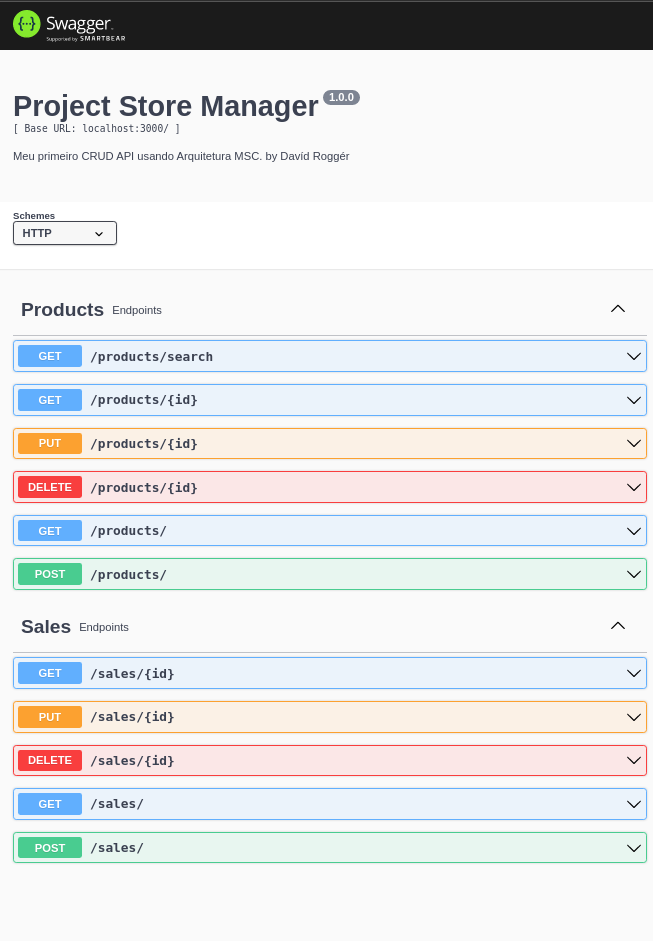

# Sobre o Projeto 

Desenvolvido um CRUD de uma API utilizando arquitetura **MSC** (Model Service Controller), de uma loja de super heroes.

<a href="./img/swagger_allroutes.png">
</img>
</a>
<a href="./img/swagger_getProductId.png">
</img>
</a>
<a href="./img/swagger_getProductName.png">
</img>
</a>

# Tecnologias e ferramentas usadas 🛠

# Desafios

- Boa parte do projeto foi desenolvida usando o metodo **TDD** (Test Driven Development), uma outra parte para entender melhor o que era retornado e entender o que deveria ser aplicado no teste unitário fiz sem TDD aplicando o teste na sequência.

- Organizar toda aplicação, cada arquivo responsável por uma determinada parte. **Route** centralizando todas as rotas de um determinado caminho para lidar somente com aquela roda em especifico. **Controller** lidando com requisições e chamando **Serviços** responsaveis por lidar com validações e chamadas de busca no banco por meio dos **models**.

- Entender a documentação da biblioteca do **Joi**, para ter mais eficiência e agilidade nas validações do corpo necessário para o melhor funcionamento das requisições.

# Conclusão

Maior desafio foi de como definir os testes iniciais, como escrever de forma clara (usando o inglês para treino do idioma), organizar as funcionalidades em camadas da API usando o conceito de **MSC**, encontrar funcionalidades que facilitariam as validações usando o **joi**, e também entender o que os requisitos dos testes solicitados pela trybe do projeto esperavam no desenvolvimento.
Quero melhorar algumas partes do projeto na parte de teste, e a parte de documentação do swagger, essa foi a minha primeira vez usando ele, para coletar algumas imagens e aprensentar alguns endpoints.

# Instalando este respositório.

# 🚧 README em construção 🚧